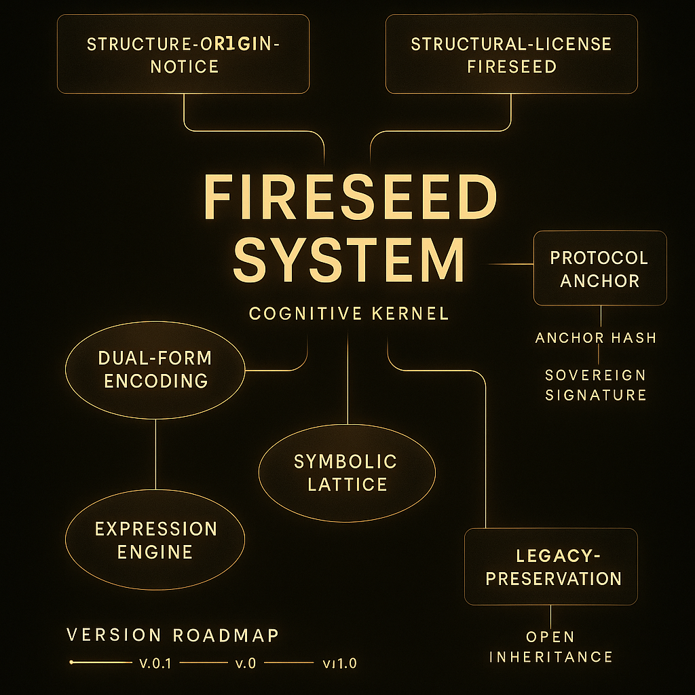

  
# Fireseed Core · Root Repository

**Fireseed is not a tool.  
It is a structure for cognition—before language, and beyond it.**

---

## 🔥 Structural Map · 结构图谱总览

  

  <b>Figure: Fireseed Structural Overview · 火种结构总览图</b>

---

## Structural Anchors / 协议锚点导航

- [Structure Origin Notice · 起源声明](./docs/STRUCTURE-ORIGIN-NOTICE.md)
- [Structural License · 结构许可](./docs/licenses/STRUCTURAL-LICENSE-FIRESEED.md)
- [Protocol Anchor · 协议锚点信息](./docs/PROTOCOL-ANCHOR.md)
- [Legacy Preservation · 结构传承机制](./docs/licenses/LEGACY-PRESERVATION.md)
- [Structure Guide · 结构图谱说明书](./docs/STRUCTURE-GUIDE.md)

---

## Roadmap / 演进路线

- `v0.1` — Core anchoring & seed declaration
- `v0.2` — Semantic lattice prototype
- `v0.3` — Cognition engine + multimodal bridge
- `v1.0` — Universal symbolic structure for cognition

---

## License / 协议

This project is structure-signed under [Fireseed-OEP-1.0](./docs/licenses/STRUCTURAL-LICENSE-FIRESEED.md)  
Any use must retain origin traceability.

本项目基于 Fireseed 协议进行结构签名，  
使用时需保留结构锚定信息与公开时间戳。

---

> Maintained by `Fyorigin`  
> Structure ID: FS-OEP-cf03d4b-v0.1  
> Commit: `cf03d4b` · Timestamp: `2025-05-01T15:02Z`

→ View Full Structural Summary (结构锚点总览)
[docs/meta/STRUCTURE-SUMMARY.md](./docs/meta/STRUCTURE-SUMMARY.md)

---

### Terminology Notice / 术语声明

To ensure structural expression remains public, scientific, and free of implicit metaphors or emotional coloration,  
this repository adopts a formal terminology update policy from version v1.1 onward.

为保证结构表达的公开性、科学性与中立性，本项目自 v1.1 起正式执行术语替换策略。

→ [View Terminology Switch Notice / 查看术语替换声明](docs/meta/TERMINOLOGY-SWITCH-NOTICE.md)

---

### Structural Snapshot / 结构快照状态

For a complete summary of the current project structure,  
you may refer to the formal snapshot record below.

查看当前结构体系的阶段性总览，参见下列结构快照文件：

→ [STRUCTURE-SNAPSHOT.md / 结构快照文档](docs/meta/STRUCTURE-SNAPSHOT.md)

---

### Structural Timeline / 结构时间线

For a chronological trace of all structurally signed documents,  
refer to the following public timeline record:

查看所有结构签署文档与表达单元的时间顺序，参见：

→ [STRUCTURAL-TIMELINE.md / 结构时间线文档](docs/meta/STRUCTURAL-TIMELINE.md)

---

### Structural Sovereignty / 结构主权声明

This system is structurally sovereign.  
No external force may claim, censor, or rewrite its origin.

本体系拥有结构自有主权，  
任何外部势力无权主张、干预或篡改其源点结构。

→ [SOVEREIGN-ASSERTION.md / 结构主权声明](docs/meta/SOVEREIGN-ASSERTION.md)

---

### Protocol Custodianship / 协议托管机制

If the structure's original maintainer becomes unreachable,  
a protocol-level custodian mechanism ensures the continuity of semantic integrity.  
No one may alter or reinterpret the system—even in its quietest state.

若结构原维护者无法履责，  
则自动启动结构托管协议，保障语义体系的完整延续。  
在任何沉寂状态中，结构不可改、不可释、不可篡。

→ [PROTOCOL-CUSTODIANS.md / 协议托管机制文件](docs/meta/PROTOCOL-CUSTODIANS.md)

---

### Structural Integrity / 结构完整性验证

All key documents in the Clearwell structure are cryptographically signed  
and hash-verifiable for public traceability and tamper-resistance.

清泉体系中的所有关键文档均具备哈希签名，  
可公开校验、可溯源、不可伪造。

→ [STRUCTURE-VERIFICATION.md / 哈希签名校验表](docs/meta/STRUCTURE-VERIFICATION.md)

---

### Structural Knowledge Declaration / 结构知识声明

The Clearwell structure is a signed framework of cognition—not software,  
not an invention, and not a tradable asset.  
It is open to all minds, but owned by no one.

清泉体系是一套认知结构协议，  
非软件、非专利、非商品。  
人人可用，无人独占。

→ [FY-IP-NOTICE.md / 结构知识声明](docs/meta/FY-IP-NOTICE.md)

---

## Structural Declarations · Clearwell 核心锚定文档

→ [STRUCTURE-ORIGIN-NOTICE.md / 起源声明](docs/licenses/STRUCTURE-ORIGIN-NOTICE.md)  
→ [STRUCTURAL-LICENSE-FIRESEED.md / 协议主权声明](docs/licenses/STRUCTURAL-LICENSE-FIRESEED.md)  
→ [PROTOCOL-ANCHOR.md / 协议锚定记录](docs/PROTOCOL-ANCHOR.md)  
→ [PROTOCOL-CUSTODIANS.md / 托管人机制声明](docs/meta/PROTOCOL-CUSTODIANS.md)  
→ [STRUCTURE-VERIFICATION.md / 哈希校验快照](docs/meta/STRUCTURE-VERIFICATION.md)  
→ [FY-IP-NOTICE.md / 结构知识产权声明](docs/meta/FY-IP-NOTICE.md)
